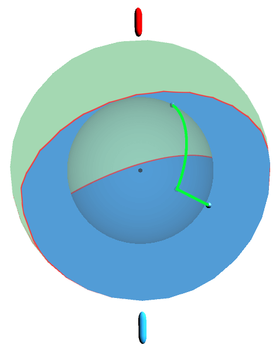
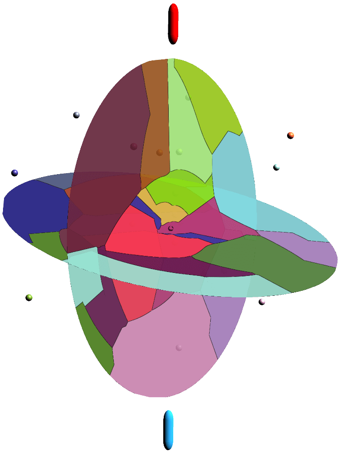
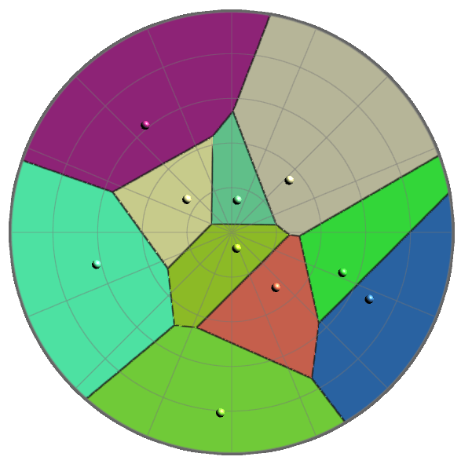
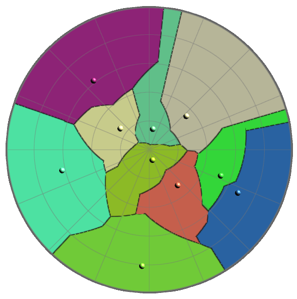
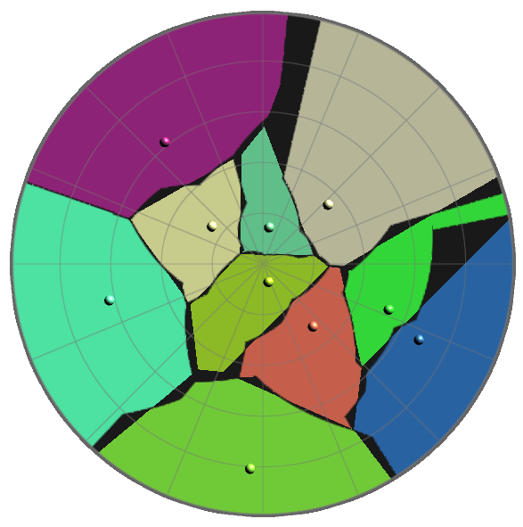
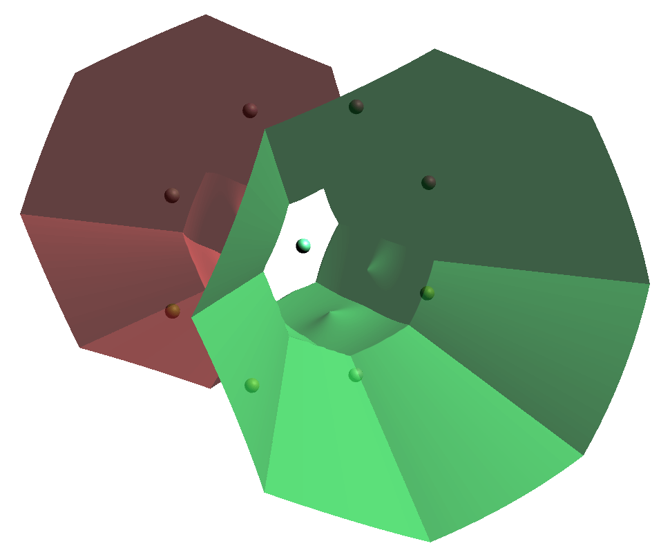

# Karlsruhe Metric in 3D
An interactive Unity-based visualization of Voronoi diagrams using the Karlsruhe metric. This project was developed as part of an advanced software practical at university.

The project page can be found at https://pille.iwr.uni-heidelberg.de/~voronoi02/

A limited web demonstration can be run here: https://samuelessig.github.io/Karlsruhe-Metric-in-3D/

This project is based on https://github.com/SebastianZins/Spherical-Karlsruhe-Metric

## Features
- Voronoi Diagrams in 3D using different fragment shader visualizations
  - Bisector surface of two points
  - Cross-sections of the 3D Voronoi diagram
  - 2D Voronoi diagrams on a circle
  - Cell boundary of a single Voronoi cell
  - Onion-like layers showing the Karlsruhe path along arcs and radials

- Metric Switching:
  - Euclidean distance
  - Karlsruhe distance
  - Overlap Mode: Highlights regions where both metrics agree.

- Grow Animation: Voronoi cells expand from reference points according to the selected metric.
- Interactive Reference Points:
  - Randomly generated points in a sphere
  - Click and drag to reposition points
  - Shift + Drag to move all points simultaneously to highlight translation dependence/invariance

## Technologies Used
- Unity Engine (2022.x or later recommended)
- Unity Shader Language (HLSL/ShaderLab)
- C# for input handling and synchronization
- GPU fragment shaders for real-time Voronoi computation

## Screenshots
### Path of the Karlsruhe Metric



### Cross-sections of the Karlsruhe Metric Voronoi diagram



### 2D Voronoi diagrams

Euclidean Distance      |  Karlsruhe Distance     |  Overlap/Difference
:-------------------------:|:-------------------------:|:-------------------------:
  |   | 


### Bisector of two points in 3D

TODO add video here with drag and drop


### Cell boundary of a single Voronoi cell in 3D



## Getting Started

Windows:
1. Download the release and extract it.
2. Run the .exe file and explore the visualization.

Alternatively:
1. Clone the repository:
```bash
https://github.com/SebastianZins/Spherical-Karlsruhe-Metric
```
2. Open the project in Unity
3. In the Project explorer navigate to `Assets/Scenes/` and double click `Karlsruhe3Dshaders`
4. Press Play at the top to start the visualization

## 📄 License
MIT License. See LICENSE.md for details.
